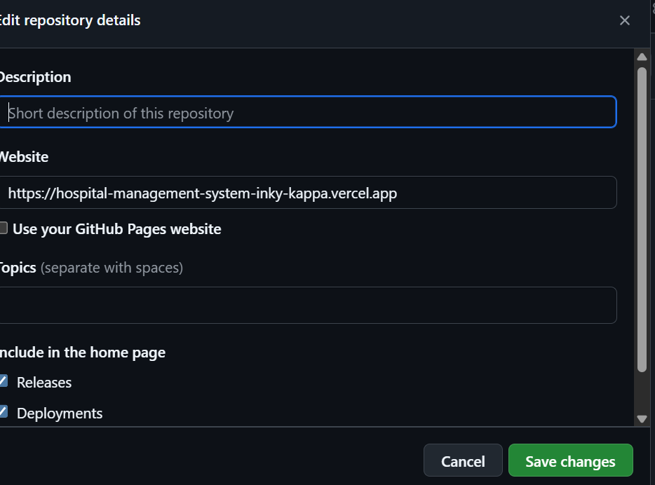

# Apex Health Care

Apex Health Care is a dark-theme hospital management system built for Indian hospital operations. It brings patient registration, appointment scheduling, medical records, INR billing, pharmacy inventory, pharmacy orders, analytics, and protected admin access into one calm operational workspace.

Live production: https://hospital-management-system-inky-kappa.vercel.app



## Project Description

Apex Health Care is designed as a full-stack healthcare operations dashboard for hospital staff. The system uses Supabase for authentication and database storage, while the frontend is built with React, TypeScript, Vite, Tailwind CSS, TanStack Query, and Recharts.

The product direction is India-focused: INR billing, +91 phone flows, Indian-style sample hospital data, GST/payment language, local hospital workflow labels, and a soft dark clinical interface that avoids luxury or finance-first visual treatment.

## Key Modules

- Dashboard: daily care flow, appointment queue, billing snapshot, pharmacy alerts, and operational charts.
- Patients: add, edit, view, search, filter, and delete patient records.
- Appointments: schedule appointments, update status, view details, and delete entries.
- Medical Records: create and view clinical records with diagnosis, symptoms, treatment, notes, and vitals.
- Billing: create invoices, track paid/pending/partial/overdue status, and mark bills paid.
- Pharmacy: add medicines, monitor stock status, create pharmacy orders, and dispense pending orders.
- Reports: analytics views for care, revenue, departments, and operational performance.
- Authentication: Supabase sign up, sign in, protected routes, and real logout.

## Tech Stack

- React 19
- TypeScript
- Vite
- Tailwind CSS
- React Router
- TanStack Query
- Supabase Auth
- Supabase Database
- React Hook Form
- Zod
- Recharts
- Vitest
- Vercel

## Architecture

```text
components/          Shared layout, header, sidebar, and reusable modals
data/                Static reference data and chart samples
pages/               Route-level application screens
src/auth/            Supabase auth provider and protected route logic
src/hooks/           TanStack Query hooks for app data
src/lib/             Supabase and React Query clients
src/services/        Supabase-backed service layer
types/               Shared TypeScript entity definitions
utils/               Money formatting and utility helpers
docs/assets/         README screenshots and documentation assets
database_schema.sql  Supabase database schema
vercel.json          Vercel SPA routing rewrite
```

## Database

The project uses Supabase tables for:

- `patients`
- `appointments`
- `bills`
- `medicines`
- `pharmacy_orders`
- `medical_records`
- `doctors`

The schema uses readable application IDs such as `P001`, `A001`, `B001`, `M001`, `PO001`, and `MR001`.

To set up the database:

1. Create a Supabase project.
2. Open the Supabase SQL Editor.
3. Run `database_schema.sql`.
4. Confirm your admin user or disable email confirmation for demo use.
5. Add the Supabase environment variables locally and in Vercel.

## Environment Variables

Create `.env.local` for local development:

```bash
VITE_SUPABASE_URL=your_supabase_project_url
VITE_SUPABASE_ANON_KEY=your_supabase_anon_key
VITE_APP_NAME=Apex Health Care
VITE_ENVIRONMENT=development
```

For Vercel, add at least:

```bash
VITE_SUPABASE_URL
VITE_SUPABASE_ANON_KEY
```

Do not commit `.env`, `.env.local`, or production secrets.

## Local Development

Install dependencies:

```bash
npm install
```

Start the development server:

```bash
npm run dev
```

Run type checks:

```bash
npm exec tsc -- --noEmit
```

Run unit tests:

```bash
npm test
```

Create a production build:

```bash
npm run build
```

## Deployment

The project is deployed on Vercel as a Vite single-page application.

Recommended Vercel settings:

- Framework preset: Vite
- Install command: `npm install` or `npm ci`
- Build command: `npm run build`
- Output directory: `dist`

`vercel.json` rewrites all routes to `index.html`, so protected SPA routes such as `/dashboard`, `/patients`, `/billing`, and `/pharmacy` work on direct refresh.

GitHub Pages is not used for this project. The old GitHub Pages workflow has been removed; Vercel is the production deployment target.

## Verification

The current production-ready codebase passes:

```bash
npm exec tsc -- --noEmit --pretty false
npm run build
```

Unit tests are included for INR utility functions and service logic:

```bash
npm test
```

## Repository Description

Use this for the GitHub repository description:

```text
India-focused hospital management system built with React, TypeScript, Supabase, Tailwind CSS, and Vercel.
```

## Suggested Topics

Use these GitHub repository topics:

```text
react typescript vite supabase tailwindcss hospital-management healthcare-dashboard india inr billing pharmacy appointments medical-records tanstack-query vercel
```

## Project Scope

This is a portfolio-grade full-stack web application using Supabase as the backend. It is suitable for demonstrating frontend architecture, protected routing, data workflows, CRUD operations, deployment, and India-focused product design.

It is not a certified hospital information system, EHR, or compliance-ready medical product. Production healthcare use would require stronger role-based access control, audit logs, backups, compliance review, and deeper clinical workflow validation.

## Author

Built by Tanishk Rathore.
